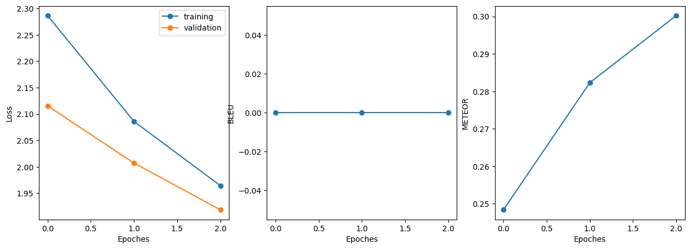

# Introduction
The core objective of this assignment revolved around the development of an algorithm or a set of models capable of 
converting text written in a toxic style into text with a neutral tone while preserving the original meaning. 
Addressing this challenge can be approached through various methods, including dictionary-based techniques and machine 
learning models. For this project, the focus was on exploring Seq2Seq models that leverage deep neural networks.

In the pursuit of this goal, I delved into the implementation and evaluation of two distinct models: 
the AutoEncoder LSTM and the Transformer. Furthermore, I conducted a series of experiments employing the T5-base 
pre-trained language model, specifically tailored for the detoxification task. This endeavor aimed to harness the power 
of advanced neural network architectures and pre-trained language models to enhance the detoxification process.

# Data analysis

- Some sentences became worse after translation. I solved this issue by simple swapping of ref text and target text.
- Moreover, some texts did not significantly change their toxicity level after translation. Therefore, I used formula
`|ref_tox - trn_tox| > diff`, where `diff` is sufficient difference between levels for preventing toxic translations.

- The length of majority of sentences is less than 50. And the average length is `12.4`.

Additionally, I remove all words that were in the whole dataset only once.

# Model Specification
I tested a range of Seq2Seq models, each differing in their architectural nuances, while adhering to the fundamental 
encoder-decoder pattern. 

# Training Process
My final solution was pre-trained on our dataset, therefore, I did not train T5. 

But I trained two other models, and I challenge many problems. I will describe only the most important in my point of view.
- Firstly, vocabulary size was great. After considering all
stuff from `Data analysis` I reduce it to `~37000`. Still it is great number, but it was fine for my training.
- The next issue was hyperparameters tuning. I tried to balance between training time and results' quality. My baseline 
for time per epoch were ~2 hours. With this condition I run LSTM for 4 epochs(but notebook didn't save the last epoch 
result), Transformer for 10 epochs.

## LSTM

## Custom Transformer

# Evaluation
In the evaluation process, I opted for widely recognized metrics commonly employed in machine translation tasks. 
The metrics I employed for assessing the performance of the models are as follows:
- METEOR: METEOR is another evaluation metric used to measure the quality of machine-generated text. It takes into 
account various aspects, such as precision, recall, stemming, synonymy, stemming, and word order. By considering a 
broader set of linguistic features, METEOR offers a comprehensive evaluation of the generated content's quality and 
fluency.
- I had BLEU too, but something went wrong, therefore, just METEOR.

For the evaluation process, I employed a subset of ParaNMT, comprising 10000 text pairs for assessing the performance of 
each model. This dataset selection allowed for a robust evaluation of the models' ability to transform toxic text 
into neutral text while preserving meaning and linguistic quality.

# Results
Inference example: 
Input: `i pay to watch them masturbate` 
LSTM: `i 'm not going to be a , , i do` 
Transformer: `sometimes i pay them to watch them.` 
T5: `i pay to watch them masturbate` 

As you can see, transformers perform much better.

More inference examples you can find in `Solution Building Report`.

Metrics evaluation:

| Model | METEOR |
| ----- |------|
| LSTM | 0.31 |
| Custom Transformer | 0.39 |
| T5 | 0.728 |
