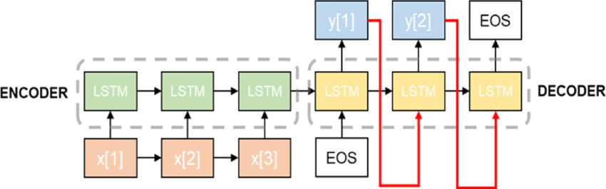
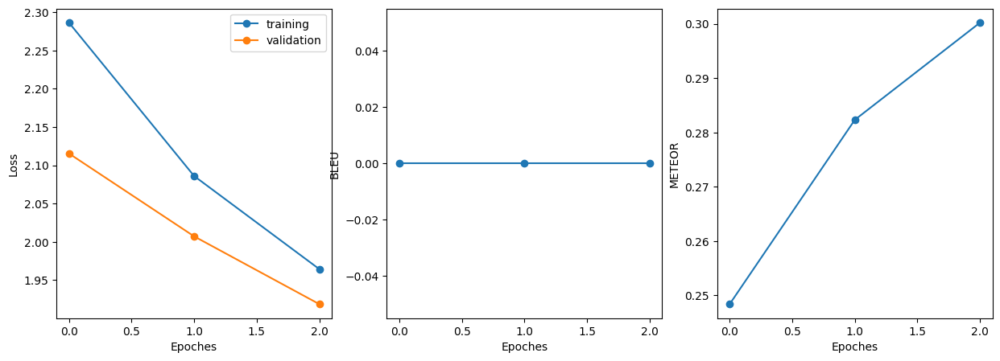
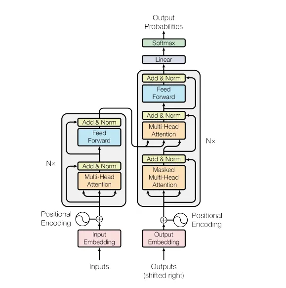
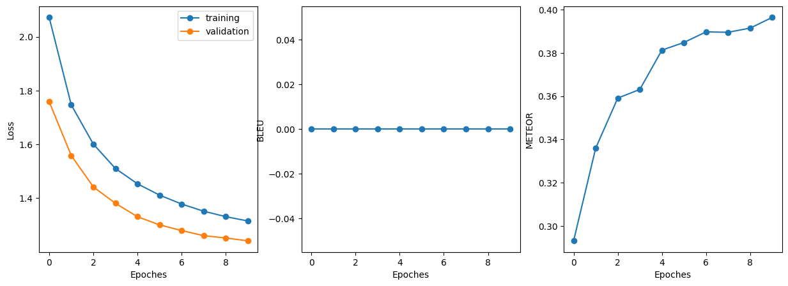

# Solution Building Process

## First thoughts about solutions
> Firstly, I considered the use of a dictionary-based profanity system as an initial solution for text detoxification. 
> The idea was straightforward – simply remove or mask inappropriate words within the text, possibly by replacing 
> them with more neutral or user-defined variants. In my exploration of this approach, I came across an enlightening 
> [article on list-based profanity systems](https://dl.acm.org/doi/abs/10.1145/2207676.2208610).
> The article shed light on some key limitations of such dictionary-based systems. 
> One of the primary drawbacks is their susceptibility to circumvention. Users can easily find ways to bypass these 
> filters by altering spellings, using abbreviations, or employing creative workarounds. Additionally, dictionary-based 
> systems tend to quickly become outdated and "stale" since they cannot adapt to evolving language, new slang, 
> or contextual changes. Moreover, these systems often provide a generic, one-size-fits-all solution. They lack the 
> flexibility to cater to specific domains or contexts, which is essential for effective text detoxification. In 
> reality, toxic language can vary greatly based on the platform, community, or topic of discussion. Therefore, a more 
> adaptive and context-aware approach may be required to address the nuances of text detoxification effectively.

## Baseline: Custom Embedding with LSTM

### Architecture:
 - My baseline model utilized custom word embeddings with a multilayered LSTM network inspired by the article ["Sequence to Sequence Learning with Neural Networks"](https://arxiv.org/abs/1409.3215).
 - The LSTM architecture consisted of multiple layers, allowing it to capture sequential dependencies effectively.
 - First, we have embedding, after that encoder to capture important information from text. 
    Next is decoder part which generate continuation for input with respect to encoder extractions.
    In the end we have fully connected layer for classification.

### Motivation:
 - I chose this architecture as a simple starting point for addressing text detoxification.
 - Custom embeddings were employed to capture word-level semantics specific to our detoxification task.
 - Despite being a sequential model, it became apparent that the LSTM had limitations in capturing context effectively.

### Data:
 - Data preprocessing included various techniques, such as rare word removal and tokenization, as discussed in the `1.0` notebook.
 - Special tokens, including `<bos>` (beginning of sequence), `<eos>` (end of sequence), and `<pad>` (padding), were introduced into the data to provide context to the model and aid in understanding text boundaries. The same preprocessing steps were applied to other models.

### Challenges:
 - The baseline model faced difficulties in handling context-related toxicity and addressing subtle nuances in toxic language.
   - Notably, it struggled to correctly determine the ending point of a translation, often leading to run-on sentences and repetitive text. For example, the model generated less meaningful translations like `I gonna, be you you, you`, highlighting its limitations.
   - Hyperparameter tuning proved challenging, as LSTM-based seq2seq models can be sensitive to parameter choices.
 - The lengthy training process, taking approximately 2 hours for one epoch, presented a significant time challenge.
 - Several attempts were made to train the baseline model, with initial efforts marred by issues in training and validation pipelines. Despite the encountered difficulties, I persevered and completed the training. However, the LSTM model's performance remained subpar.

### Result:
> - Unfortunately, there was an error in my BLEU score calculation, resulting in a score of 0 for all evaluations. It's important to note that this was for metric checking purposes, and not representative of the model's true performance.
> - As depicted in the loss plots, the models reduced their loss over time. However, inference results were still unsatisfactory.
> - In conclusion, LSTM models could potentially perform well given the right hyperparameters and a substantial number of training epochs. However, the lack of extensive computational resources limited this approach. Therefore, LSTM turned out to be inadequate and inefficient for the text detoxification task.

> Inference example 

`Input: looks like a box full of` 
`Continuation: he 's a , , , ,` 
`Translation: it looks like a box full of `` finding your own . ''` 

`Input: the fucking gun` 
`Continuation: 'if korba .` 
`Translation: drop the gun .` 

`Input: i pay to watch them masturbate` 
`Continuation: i 'm not going to be a , , i do` 
`Translation: sometimes i only pay for looking .` 

`Input: damn it , no man lives in a vacuum` 
`Continuation: he 's a , , , , , cpa .` 
`Translation: `` hell , no one lives in a vacuum !` 

`Input: , shit` 
`Continuation: no one .` 
`Translation: blimey !` 

`Input: you any of this desert ufo lunatics` 
`Continuation: he 's a , , the , , , ,` 
`Translation: y'all some of those desert ufo freaks ?` 

- As you can see, model is very weak.

## Hypothesis 1: Custom Transformer

### Architecture:
- The implementation and explanation were inspired by [this article](https://towardsdatascience.com/a-detailed-guide-to-pytorchs-nn-transformer-module-c80afbc9ffb1).
- The custom transformer architecture consists of a multi-layer transformer model. It utilizes positional and word embeddings to better capture long-range dependencies and context in the text.0

### Motivation:
- Transformers have demonstrated superior performance in various NLP tasks, primarily due to their self-attention mechanism.
- We aimed to leverage this power for detoxification.
- Transformers exhibit faster training compared to LSTM seq2seq models and also produce superior results. Therefore, they have become our preferred choice.

### Data:
- The data is the same

### Challenges:
- Initially, it was challenging to comprehend the intricacies of the transformer workflow.
- After completing the LSTM training pipeline, there were limited challenges during this phase.
- When using a large embedding size, the model tended to generate the <eos> token as the first continuation, making it challenging to find the right model parameters.

### Results:
> - The same situation with BLEU...
> - Training with transformer was approximately twice as fast as with LSTM.
> - The loss converged rapidly, and it's evident that further training epochs could potentially yield even smaller losses.
> - METEOR scores were quite good. BLEU is still zero T-T

> Inference example 

`Input: looks like a box full of` 
`Continuation: looks like a box full of .` 
`Translation: it looks like a box full of` 

`Input: the fucking gun` 
`Continuation: the gun .` 
`Translation: drop the gun .` 

`Input: i pay to watch them masturbate` 
`Continuation: sometimes i pay them to watch them .` 
`Translation: sometimes i only pay for looking .` 

`Input: damn it , no man lives in a vacuum` 
`Continuation: hell , no man lives in a vacuum !` 
`Translation: hell , no one lives in a vacuum !` 

`Input: , shit` 
`Continuation: , man !` 
`Translation: blimey !` 

`Input: you any of this desert ufo lunatics` 
`Continuation: you 're any of this desert , dr. crazy ?` 
`Translation: y'all some of those desert ufo freaks ?` 

## Hypothesis 2: Pretrained Transformer

### Architecture:
- I found a pretrained *(on our dataset)* transformer model, T5, for the detoxification task.
- T5 was selected due to its strong contextual understanding of language.
- T5 is a Transformer based architecture that uses a text-to-text approach. The changes compared to BERT include:
  - adding a causal decoder to the bidirectional architecture. 
  - replacing the fill-in-the-blank close task with a mix of alternative pre-training tasks.
  

### Motivation:
- Pretrained models offer powerful representations and have been successful in a wide range of NLP tasks.
- I don't have powerful graphic card for training, therefore, I have to take pretrained T5 or other.

### Data:
- The same data.

### Results
- METEOR score = `0.728`. It's pretty good result.