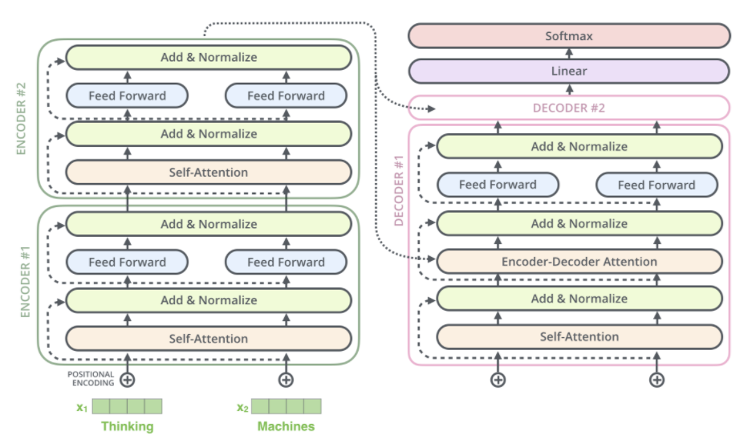

# Solution Building Process

## First thoughts about solutions
> Firstly, I 

## Baseline: Custom Embedding with LSTM

### Architecture: 
 - My baseline model utilized custom word embeddings with a multilayered LSTM network. 
It was inspired by [article "Sequence to Sequence Learning with Neural Networks"](https://arxiv.org/abs/1409.3215).
 - Word embeddings were trained with LSTMs.
 - First, we have embedding, after that encoder to capture important information from text. 
   Next is decoder part which generate continuation for input with respect to encoder extractions.
   In the end we have fully connected layer for classification.

### Motivation:
 - I chose this architecture as a simple starting point to address text detoxification.
 - The custom embeddings allow capturing word-level semantics specific to our task.
 - Although LSTM is a sequential model, it turned out to have limitations in capturing context effectively.

### Data:
 - The data preprocessing steps included rare word removal, tokenization, and other techniques as discussed in the `1.0` notebook.
 - Special tokens `<bos>` (beginning of sequence), `<eos>` (end of sequence), and `<pad>` (padding) were added to the data. These tokens provide context to the model and help in understanding the boundaries of the text.
 - Moreover, for other models I used the same preprocessing.

### Challenges:
 - The baseline model struggled with context-related toxicity and handling subtle nuances in toxic language.
   - For instance, it sometimes failed to correctly determine the ending point of a translation, leading to run-on sentences.
   - ***ADD MORE HERE***
 - The lengthy training process, taking approximately 2 hours for one epoch, posed a significant time challenge.
 - I made multiple attempts to train the baseline model. The initial attempts were plagued by issues in my training and validation pipelines. 
   - Subsequently, the model generated less meaningful translations, such as repetitions like `I gonna, be you you, you,` which was a clear indication of its limitations.
   - Despite encountering difficulties, I persevered and managed to complete the training. However, the LSTM model's performance remained subpar.

### Result:
> - I made a mistake somewhere in BLEU calculation. Therefore, I have 0 score everywhere. I didn't have for retraining just for metric checking, so please do not look at middle plot.
> - asd

> Inference example 

`Input: looks like a box full of` 
`Continuation: he 's a , , , ,` 
`Translation: it looks like a box full of `` finding your own . ''` 

`Input: the fucking gun` 
`Continuation: 'if korba .` 
`Translation: drop the gun .` 

`Input: i pay to watch them masturbate` 
`Continuation: i 'm not going to be a , , i do` 
`Translation: sometimes i only pay for looking .` 

`Input: damn it , no man lives in a vacuum` 
`Continuation: he 's a , , , , , cpa .` 
`Translation: `` hell , no one lives in a vacuum !` 

`Input: , shit` 
`Continuation: no one .` 
`Translation: blimey !` 

`Input: you any of this desert ufo lunatics` 
`Continuation: he 's a , , the , , , ,` 
`Translation: y'all some of those desert ufo freaks ?` 

- Model is very weak.

## Hypothesis 1: Custom Transformer

### Architecture:
- Our custom transformer architecture consisted of a multi-layer transformer model.
- This architecture was designed to better capture long-range dependencies and context in the text.

### Motivation:
- Transformers have shown superior performance in various NLP tasks due to their self-attention mechanism.
- We aimed to leverage this power for detoxification.

### Data:
- The data the same

### Challenges:
- Training a custom transformer required a substantial amount of computational resources.

### Results:
- The same situation with BLEU...
- 

## Hypothesis 2: Pretrained Transformer

### Architecture:
- I found a pretrained *(on our dataset)* transformer model, T5, for the detoxification task.
- T5 was selected due to its strong contextual understanding of language.

### Motivation:
- Pretrained models offer powerful representations and have been successful in a wide range of NLP tasks.
- I don't have powerful graphic card for training, therefore, I have to take pretrained T5 or other.

### Data:
- We adapted our dataset to the format expected by the BERT model, including tokenization and special token additions.

## Results
